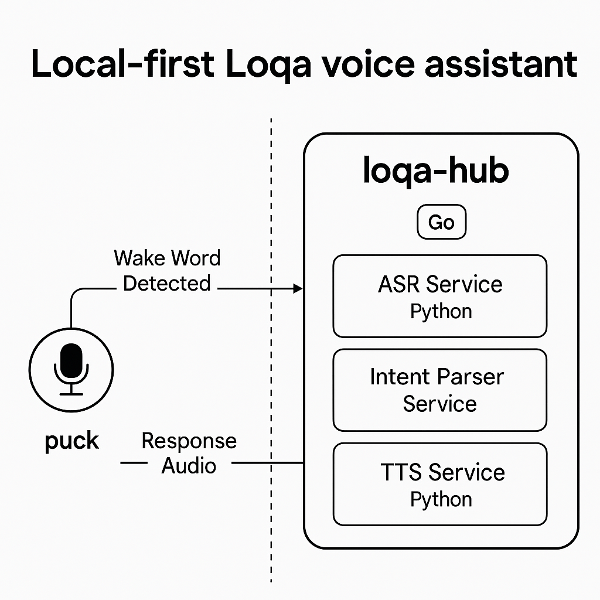

# 🧠 Loqa Architecture

Loqa is built from the ground up as a **local-first**, event-driven voice assistant platform. It uses a modular microservice architecture, with real-time voice input, natural language understanding, and device control — all running locally.

---

## 🧱 Core Components

### 🎤 Puck Device
- Edge device for capturing voice input
- Runs wake word detection and streams audio over gRPC
- Prototype implemented in Go with PortAudio
- Future versions will use ESP32-S3 with wake word firmware

### 🧠 Hub Service
- Central logic for speech-to-text, intent parsing, and event routing
- Uses Whisper.cpp for offline transcription
- Sends text to Ollama (Llama 3.2) for command parsing
- Publishes parsed commands to NATS message bus

### 📡 NATS Server
- High-performance local message bus
- Powers pub/sub communication between services
- Used for voice input, command dispatching, and device state

### 🏠 Device Service
- Listens for device-specific commands
- Handles execution for simulated or real devices (e.g., lights, music)
- Publishes status and response events back to NATS

---

## 🔁 Voice Input → Action Flow



*System overview showing the flow from puck audio input to device control*

```mermaid
graph TB
    P[🎤 Puck Device] -->|gRPC| H[🧠 Hub Service]
    H -->|Text| W[📝 Whisper STT]
    H -->|Text| L[🤖 LLM (Ollama)]
    H -->|Intent| N[📡 NATS]
    N -->|Command| D[🏠 Device Service]
    D -->|Effect| DEVICES[💡 Real Devices]
```

1. **User speaks** near puck
2. Puck captures audio and streams to Hub
3. Hub uses Whisper to transcribe to text
4. Text sent to LLM for intent parsing and entity extraction
5. Resulting command published to NATS
6. Device Service receives and acts on command

---

## ⚙️ Technologies Used

| Area         | Technology              |
|--------------|--------------------------|
| Voice STT    | Whisper.cpp              |
| LLM          | Ollama + Llama 3.2       |
| Messaging    | NATS                     |
| Audio Input  | gRPC (Go), PortAudio     |
| Orchestration| Docker Compose           |
| Devices      | Go microservice          |
| Hardware     | ESP32-S3 (future)        |

---

## 🌐 Network Ports

| Service         | Port | Protocol |
|------------------|------|----------|
| Hub HTTP API     | 3000 | HTTP     |
| Hub gRPC Audio   | 50051| gRPC     |
| NATS             | 4222 | NATS     |
| Ollama API       | 11434| HTTP     |

---

## 🚀 Future Expansion

- Multi-device coordination (room awareness, intercom)
- Real smart home integrations (HomeKit, Zigbee, MQTT)
- Contextual memory and task chaining
- Plugin system for custom skills
- Optional secure remote access (premium tier)

---

Loqa is designed to **grow with your needs** — from offline tinkerbox to voice-driven smart home OS.