```mermaid
stateDiagram-v2
  [*] --> Idle

  Idle --> WakeDetected : wake word detected
  WakeDetected --> WaitingForGrant
  WaitingForGrant --> Streaming : grant received
  WaitingForGrant --> Idle : cancel received

  Streaming --> PlayingResponse : LLM → TTS output
  PlayingResponse --> Idle : playback finished

  PlayingResponse --> WakeDetected : barge-in detected
  PlayingResponse --> PlaybackPaused : music/timer interrupted

  PlaybackPaused --> Streaming : new wake granted
  Streaming --> PlaybackResumed : original play resumes

  PlaybackResumed --> Idle : playback finished
```

# Loqa Voice Assistant Platform

> ℹ️ This document describes the implementation of **Loqa Core** — the foundational, local-first platform for future voice assistant capabilities.
>
> It is not the full product vision. Innovation vectors like Natural Skill Learning, Conversational Memory, and Multi-Agent Collaboration are planned as post-MVP extensions.

Loqa is a **local-first**, event-driven voice assistant platform designed for privacy, extensibility, and real-time responsiveness. It combines modular microservices with advanced natural language understanding and device control — all running locally to empower users with a smart home OS that respects privacy and adapts to their needs.

---

## Visual Architecture

```mermaid
flowchart TB
  subgraph Puck
    P[🎤 ESP32 or loqa-puck-go]
  end

  subgraph Hub
    HC[🧠 Hub Core]
    ARB[⚖️ Arbiter & Session Manager]
    STT[📝 STT (streaming)]
    NLU[🤖 LLM Intent Parser]
    SCHED[🎛️ Playback Scheduler & Queue]
    TTS[🔊 TTS (streaming)]
    NATS[(📡 NATS Event Bus)]
    SKILLS[🧩 Skills Engine]
  end

  subgraph Integrations
    INTEG[🔌 Device Integrations]
    DEV[💡 Smart Devices]
  end

  subgraph Observability
    UI[📊 Commander Admin UI]
  end

  %% Audio path
  P -- HTTP/1.1 Uplink (PCM16, chunked) --> HC
  HC --> ARB
  HC --> STT
  STT -- partial transcripts --> NLU
  NLU -- intent/plan --> SKILLS
  SKILLS -- commands --> INTEG
  INTEG -- actions --> DEV
  NLU -- response text --> TTS
  HC --> SCHED
  SCHED --> TTS
  TTS --> HC
  HC -- HTTP/1.1 Downlink (PCM16, chunked) --> P

  %% Events & control
  HC <--> NATS
  STT <--> NATS
  NLU <--> NATS
  SCHED <--> NATS
  SKILLS <--> NATS
  UI <-- REST/WS events --> HC
```

## Arbitration & Barge-In State Flow



<!--
Arbitration window is now 80–120ms (not fixed 50ms).
Runner-up fallback triggers if winner fails to stream within 500ms.
-->

---

## Architecture Decision Records (ADRs)

- [adr/0001-arbitration-scoring.md](adr/0001-arbitration-scoring.md) – Hub arbitrates multiple wake events via scoring
- [adr/0002-tiered-performance.md](adr/0002-tiered-performance.md) – System adapts to hardware tier (Basic → Pro)
- [adr/0003-wake-word-inclusion.md](adr/0003-wake-word-inclusion.md) – Full wake word is sent to improve context
- [adr/0004-barge-in-policy.md](adr/0004-barge-in-policy.md) – Barge-in triggers stop/pause by category
- [adr/0005-playback-queue-resume.md](adr/0005-playback-queue-resume.md) – Playback queues and resume logic
- [adr/0006-sunset-proto-and-sqlite.md](adr/0006-sunset-proto-and-sqlite.md) – Sunset gRPC and SQLite in favor of HTTP transport and ephemeral tracing
- [adr/0007-tiered-intelligence-cascade.md](adr/0007-tiered-intelligence-cascade.md) – Reflex + LLM cascade architecture for smart and fast intent parsing
- [adr/0008-reliability-degradation.md](adr/0008-reliability-degradation.md) – Graceful fallback and timeout strategies for STT, TTS, skills, arbitration, and messaging
- [adr/0009-skill-execution-security.md](adr/0009-skill-execution-security.md) – Trust tier-based isolation and sandboxing for skill execution (Go plugins only)
- [adr/0010-transport-http1-binary-stream.md](adr/0010-transport-http1-binary-stream.md) – Use HTTP/1.1 with binary frame streaming for puck-to-hub transport

- [../transport-specification.md](../transport-specification.md) – Full HTTP/1.1 transport contract including chunked framing, status codes, and reconnect logic
- [../binary-frame-spec.md](../binary-frame-spec.md) – Binary message format spec with endianness, control ops, and audio payload structure
- [../tier-detection.md](../tier-detection.md) – Scoring algorithm and override rules for Basic, Standard, and Pro tiers
- [../error-handling-state-machines.md](../error-handling-state-machines.md) – System and arbitration state machines for reliable fallback and recovery

---

## Core Components

- **Puck Device (ESP32-S3 / Reference Go Client)**  
  Open-source ESP32-S3 based firmware or the Go-based `loqa-puck-go` reference client for capturing local voice input and streaming audio over HTTP/1.1 using chunked transfer encoding and binary frame format. Supports mic, WAV, or silent input and optional speaker or stdout output for development and simulation.

- **Hub Service**  
  Central processing unit performing speech-to-text transcription, intent parsing via LLM, event routing, and voice event recording. Supports REST API for event access and publishes commands to the NATS message bus.

- **NATS Server**  
  High-performance local message bus enabling pub/sub communication between microservices, including voice input, command dispatching, and device state updates.

- **TTS Service (Kokoro-82M)**  
  Enterprise-grade text-to-speech service providing natural, expressive voice responses with sub-second synthesis times optimized for local deployment.

- **Commander Admin UI**  
  Vue.js-based interface for configuring skills, viewing real-time voice events, debugging playback, and managing system behavior.

- **Hybrid Skills System**  
  A flexible and secure skill integration framework comprising:
  - **Go Module Skills:** Compiled plugins with direct integration for high performance.
  - **MCP Server Skills:** Language-agnostic skills (Python, Node.js, etc.) communicating over the Model Context Protocol.
  - **Privacy Tier System:** Paranoid (local-only), Balanced (selective network), and Convenient (full-featured) privacy levels.
  - **Dynamic Capability Discovery:** Real-time detection of skill capabilities rather than static categorization.
  - **Unified API:** Abstracts differences between Go and MCP implementations for seamless integration.
  - **Security Sandboxing:** Process isolation and resource limits for MCP servers to enforce security.
  - **Vetted Registry:** Community-reviewed skills with transparent privacy metadata.

---

## Binary Frame Format

All audio and control data between relays and the hub is encoded as a fixed-length binary frame:

```
| type 1B | seq 2B | ts_ms 4B | len 2B | payload ... |
```

- `type`: `0xA1` for uplink PCM16 audio, `0xB1` for downlink audio, `0xC1` for control messages
- `seq`: sequence number
- `ts_ms`: timestamp in milliseconds
- `len`: number of bytes in payload
- Payload is raw PCM16 mono 16kHz or small JSON for control ops

---

## Technologies Used

| Area          | Technology                                        |
| ------------- | ------------------------------------------------- |
| Voice STT     | OpenAI-compatible REST                            |
| Voice TTS     | OpenAI-compatible REST (Kokoro-82M)               |
| LLM           | Ollama + Llama 3.2                                |
| Messaging     | NATS                                              |
| Admin UI      | Vue.js 3 + Vite + Tailwind                        |
| API           | REST (Go)                                         |
| Audio Input   | HTTP/1.1 (binary, PCM16 16kHz, chunked)           |
| Orchestration | Docker Compose                                    |
| Integrations  | Go plugins + MCP servers (Model Context Protocol) |
| Hardware      | ESP32-S3 (DIY)                                    |

---

## Tiered Performance Profiles

Loqa supports multiple performance profiles to balance resource usage and responsiveness based on deployment environments:

- **Paranoid Tier (Local-Only)**

  - All processing and data remain strictly on-device.
  - No network calls outside local network.
  - Maximum privacy and data security.
  - Suitable for privacy-sensitive users and offline scenarios.

- **Balanced Tier (Selective Network Access)**

  - Allows selective network calls for enhanced capabilities (e.g., cloud-based LLMs).
  - Privacy controls configurable per skill or service.
  - Suitable for users requiring advanced features with controlled privacy trade-offs.

- **Convenient Tier (Full-Featured)**
  - Full network connectivity enabled for maximum functionality.
  - Supports cloud integrations, remote access, and extensive skill ecosystem.
  - Ideal for users prioritizing convenience and feature richness over strict privacy.

Each tier is enforced via the Hybrid Skills System and network policies, enabling users to tailor Loqa to their privacy and performance preferences.

---

## Intent Parsing Pipeline

Loqa uses a tiered cascade for interpreting user commands, balancing low-latency interaction with natural language flexibility. This pipeline has three main layers _(timing SLAs proposed; must be validated via benchmarks)_:

1. **Reflex Layer**

   - Pattern-based matchers (e.g., regex, command prefix)
   - Fast, deterministic response without invoking an LLM
   - Ideal for "lights on", "volume up", etc.

2. **Local LLM Layer**

   - Local small model (e.g., Llama 3B)
   - Supports paraphrased and shortform natural commands
   - Bound to strict tool usage and command templates

3. **Cloud LLM Layer (Optional)**
   - Large or cloud-based model (e.g., GPT-4, Claude)
   - Enables multi-turn conversation, explanation, or complex flows
   - NOT automatically used; must be explicitly invoked as a separate skill
   - Most tiers do NOT include Cloud LLM by default

The TTS system may begin playback (e.g. “Okay…”) as early as the reflex or local layer, even before final parsing is complete.

Tier selection (`basic`, `standard`, `pro`, `hybrid`) determines which layers are available.

Optional Diagram:

```mermaid
graph LR
  VAD[🧠 User Speech] --> ASR
  ASR --> Reflex{Reflex Match?}
  Reflex -- Yes --> Skill[🔧 Trigger Skill Immediately]
  Reflex -- No --> SmallLLM[🧠 Local LLM (3B)]
  SmallLLM --> Plan[🧩 Plan/Tool Use]
  SmallLLM -->|Low Confidence| BigLLM[☁️ Cloud LLM (opt-in)]
  BigLLM --> Plan
  Plan --> Skill
```

---

## Intent Parsing: Executable Spec

This section specifies the concrete interfaces, thresholds, and schemas that implement the Reflex → Local LLM → Cloud LLM cascade. Claude Code and contributors should treat this as **implementation guidance** for MVP.

### Interfaces & Events (NATS subjects)

| Subject                 | Direction | Payload (JSON)                                                            |
| ----------------------- | --------- | ------------------------------------------------------------------------- | ----- | --------------------------- |
| `asr.partial`           | Hub→Bus   | `{"conversation_id","ts_ms","text","confidence"}`                         |
| `asr.final`             | Hub→Bus   | same as partial with `final:true`                                         |
| `nlu.intent.candidates` | Hub→Bus   | `{"conversation_id","source":"reflex                                      | small | large","candidates":[...]}` |
| `nlu.intent.commit`     | Hub→Bus   | `{"conversation_id","intent":IntentCandidate}`                            |
| `skill.invoke.request`  | Hub→Bus   | `{"conversation_id","plan_id","step_idx","tool","args"}`                  |
| `skill.invoke.result`   | Skill→Bus | `{"conversation_id","plan_id","step_idx","ok":bool,"data":{},"error":""}` |

**IntentCandidate schema** (JSON example):

```json
{
  "name": "timer.set",
  "slots": { "duration": "PT5M", "label": "pasta" },
  "confidence": 0.92,
  "explan": "matched reflex pattern 3",
  "requires_confirm": false
}
```

### Reflex Rules (YAML)

Create `reflex.yaml` loaded by the hub:

```yaml
entities:
  builtin:
    duration: { kind: iso8601_duration }
    time: { kind: wallclock }
    room: { kind: enum, values: [kitchen, bedroom, living room] }
rules:
  - name: timer.set
    priority: 100
    patterns:
      - "set (a )?timer for {duration}"
      - "start a {duration} timer( for {label})?"
    slots:
      duration: builtin.duration
      label: { kind: free, optional: true, max_len: 24 }
    confirm_if_ambiguous: true

  - name: lights.on
    priority: 90
    patterns:
      - "(turn|switch) (the )?{room}? lights on"
    slots:
      room: builtin.room
```

**Scoring (default):** Pattern hit (+0.6), entity extraction ok (+0.2), exact synonym (+0.1), prior usage bias (+0.1). The reflex engine returns `IntentCandidate[]` with computed confidences.

### Router Algorithm (pseudo)

_(timing SLAs proposed; must be validated via benchmarks)_

```
on asr.partial(text, conf):
  if reflex.match(text).top.conf >= 0.90:
     commit(intent=top)            // publish nlu.intent.commit
     // opener plays only if commit occurred or confidence >= 0.90
     tts.open("Okay…")            // speak-while-you-think opener
     plan = plan_from_intent(top)
     execute(plan)
     return

  if tier >= standard:
     stream_to_small_llm(text)     // keep accumulating
  else:
     wait for asr.final and then reflex-only

on asr.final(text, conf):
  cand_reflex = reflex.match(text).top
  if cand_reflex.conf >= 0.80:
     commit(cand_reflex); execute(plan_from_intent(cand_reflex)); return

  if tier == standard:
     cand_small = small_llm.parse(text)
     if cand_small.conf >= 0.70: commit(cand_small); execute(...)
     else if tier == pro and allow_cloud:
         cand_large = large_llm.parse(text)
         commit_if(cand_large.conf >= 0.70)
     else prompt_for_clarification()

timeouts:
  small_llm.first_tokens_by <= 250ms
  large_llm.first_tokens_by <= 400ms (if used)
  total TTFB budget (Standard) <= 350ms with opener
```

### Confidence Thresholds (defaults)

- `reflex.commit ≥ 0.90` on partials; `≥ 0.80` on finals
- `small_llm.commit ≥ 0.70`
- `large_llm.commit ≥ 0.70`
- `requires_confirm: true` if 0.55–0.70 → hub asks: _“5 minutes, right?”_

### Plan / Tool-Use Schema (LLM output)

Small/large LLMs **must** emit this JSON (function-call style):

```json
{
  "plan_id": "uuid",
  "can_stream": true,
  "steps": [
    { "tool": "timer.set", "args": { "duration": "PT5M", "label": "pasta" } },
    { "tool": "timer.announce_eta", "args": { "duration": "PT5M" } }
  ]
}
```

- Each `tool` maps to a **Skill signature** (Go or MCP).
- The hub executes steps sequentially, publishing `skill.invoke.request/result`.
- If a step fails and `requires_confirm`, the hub asks the user; otherwise aborts.

#### Skill Signature Contract

Each skill declares a JSON schema (example):

```json
{
  "name": "timer.set",
  "args_schema": {
    "type": "object",
    "properties": {
      "duration": { "type": "string", "pattern": "^P(T.*)$" },
      "label": { "type": "string", "maxLength": 24 }
    },
    "required": ["duration"]
  }
}
```

The hub validates `args_schema` before invoking a tool.

### “Speak-While-You-Think” TTS

- Preload openers in RAM: `["Okay,", "Sure,", "On it,"]`.
- When `nlu.intent.commit` fires, send `tts.start(opener)` immediately.
- Stream the rest once the `plan` is ready; if the plan changes, send `tts.stop(opener_play_id)`.

### Barge-in / Cancel Intents

- Phrases: “stop”, “cancel”, “nevermind” → `system.cancel` at **highest priority**.
- On cancel: stop current `AssistantResponse`; pause/resume lower categories per ADR‑0005.

### Tier Mapping (performance)

| Tier     | Layers enabled                        | Notes (timing SLAs proposed; must be validated via benchmarks) |
| -------- | ------------------------------------- | -------------------------------------------------------------- |
| Basic    | Reflex only (LLM is opt-in)           | No cloud; opener ok                                            |
| Standard | Reflex + Local LLM                    | Target TTFB ≤ 250ms                                            |
| Pro      | Reflex + Local LLM + (optional) Cloud | Use if conf is low                                             |
| Hybrid   | Same as Pro with cloud allowed        | User opt‑in only                                               |

### Telemetry (must-have)

- `intent_reflex_hits`, `intent_reflex_conf_avg`
- `small_llm_latency_ms`, `large_llm_latency_ms`
- `intent_commit_source` distribution
- `ttfb_ms` (wake_end → first TTS frame)
- `clarification_rate`

### Test Matrix (acceptance)

- Timer: “set a 5 minute timer” (reflex) → commit < 100ms
- Lights: “make it cozy” (small LLM) → commit < 250ms
- Ambiguous: “set a timer” → confirmation prompt within 500ms
- Cancel during response → stop within 100ms

---

## Benchmark Validation

See [BENCHMARKS.md](BENCHMARKS.md) for timing, resource, and fault tolerance testing required before MVP launch.  
Includes real-world validation of tier SLAs, LLM latency, arbitration edge cases, ESP32 puck stability, and skill fault isolation.

Loqa is designed to **grow with your needs** — from offline tinkerbox to voice-driven smart home OS.

# Loqa Core Architecture

> ℹ️ This document describes the implementation of **Loqa Core** — the foundational, local-first platform for future voice assistant capabilities.
>
> It is not the full product vision. Innovation vectors like Natural Skill Learning, Conversational Memory, and Multi-Agent Collaboration are planned as post-MVP extensions.

Loqa is a **local-first**, event-driven voice assistant platform designed for privacy, extensibility, and real-time responsiveness. It combines modular microservices with advanced natural language understanding and device control — all running locally to empower users with a smart home OS that respects privacy and adapts to their needs.

---

## Visual Architecture

```mermaid
flowchart TB
  subgraph Puck
    P[🎤 ESP32 or loqa-puck-go]
  end

  subgraph Hub
    HC[🧠 Hub Core]
    ARB[⚖️ Arbiter & Session Manager]
    STT[📝 STT (streaming)]
    NLU[🤖 LLM Intent Parser]
    SCHED[🎛️ Playback Scheduler & Queue]
    TTS[🔊 TTS (streaming)]
    NATS[(📡 NATS Event Bus)]
    SKILLS[🧩 Skills Engine]
  end

  subgraph Integrations
    INTEG[🔌 Device Integrations]
    DEV[💡 Smart Devices]
  end

  subgraph Observability
    UI[📊 Commander Admin UI]
  end

  %% Audio path
  P -- HTTP/1.1 Uplink (PCM16, chunked) --> HC
  HC --> ARB
  HC --> STT
  STT -- partial transcripts --> NLU
  NLU -- intent/plan --> SKILLS
  SKILLS -- commands --> INTEG
  INTEG -- actions --> DEV
  NLU -- response text --> TTS
  HC --> SCHED
  SCHED --> TTS
  TTS --> HC
  HC -- HTTP/1.1 Downlink (PCM16, chunked) --> P

  %% Events & control
  HC <--> NATS
  STT <--> NATS
  NLU <--> NATS
  SCHED <--> NATS
  SKILLS <--> NATS
  UI <-- REST/WS events --> HC
```

## Arbitration & Barge-In State Flow


---

## Architecture Decision Records (ADRs)

- [adr/0001-arbitration-scoring.md](adr/0001-arbitration-scoring.md) – Puck arbitration and scoring for wake events
- [adr/0002-tiered-performance.md](adr/0002-tiered-performance.md) – System adapts to hardware tier (Basic → Pro)
- [adr/0003-wake-word-inclusion.md](adr/0003-wake-word-inclusion.md) – Full wake word is sent to improve context
- [adr/0004-barge-in-policy.md](adr/0004-barge-in-policy.md) – Barge-in triggers stop/pause by category
- [adr/0005-playback-queue-resume.md](adr/0005-playback-queue-resume.md) – Playback queues and resume logic
- [adr/0006-sunset-proto-and-sqlite.md](adr/0006-sunset-proto-and-sqlite.md) – Sunset gRPC and SQLite in favor of HTTP transport and ephemeral tracing
- [adr/0007-tiered-intelligence-cascade.md](adr/0007-tiered-intelligence-cascade.md) – Reflex + LLM cascade architecture for smart and fast intent parsing
- [adr/0008-reliability-degradation.md](adr/0008-reliability-degradation.md) – Graceful fallback and timeout strategies for STT, TTS, skills, arbitration, and messaging
- [adr/0009-skill-execution-security.md](adr/0009-skill-execution-security.md) – Trust tier-based isolation and sandboxing for skill execution (Go plugins only)
- [adr/0010-transport-http1-binary-stream.md](adr/0010-transport-http1-binary-stream.md) – Use HTTP/1.1 with binary frame streaming for puck-to-hub transport

- [../transport-specification.md](../transport-specification.md) – Full HTTP/1.1 transport contract including chunked framing, status codes, and reconnect logic
- [../binary-frame-spec.md](../binary-frame-spec.md) – Binary message format spec with endianness, control ops, and audio payload structure
- [../tier-detection.md](../tier-detection.md) – Scoring algorithm and override rules for Basic, Standard, and Pro tiers
- [../error-handling-state-machines.md](../error-handling-state-machines.md) – System and arbitration state machines for reliable fallback and recovery

---

## Core Components

- **Puck Device (ESP32-S3 / Reference Go Client)**

  - Open-source ESP32-S3 based firmware or the Go-based `loqa-puck-go` reference client for capturing local voice input and streaming audio over HTTP/1.1 using chunked transfer encoding and binary frame format.
  - Supports mic, WAV, or silent input and optional speaker or stdout output for development and simulation.

- **Hub Service**

  - Central processing unit performing speech-to-text transcription, intent parsing via LLM, event routing, and voice event recording. Supports REST API for event access and publishes commands to the NATS message bus.

- **NATS Server**

  - High-performance local message bus enabling pub/sub communication between microservices, including voice input, command dispatching, and device state updates.

- **TTS Service (Kokoro-82M)**

  - Enterprise-grade text-to-speech service providing natural, expressive voice responses with sub-second synthesis times optimized for local deployment.

- **Commander Admin UI**

  - Vue.js-based interface for configuring skills, viewing real-time voice events, debugging playback, and managing system behavior.

- **Hybrid Skills System**
  - **Not included in MVP.** The hybrid skills system (Go plugins + MCP servers) is planned for post-MVP. MVP skills are Go plugins only.

---

## Binary Frame Format

All audio and control data between pucks and the hub is encoded as a fixed-length binary frame:

```
| type 1B | seq 2B | ts_ms 4B | len 2B | payload ... |
```

- `type`: `0xA1` for uplink PCM16 audio, `0xB1` for downlink audio, `0xC1` for control messages
- `seq`: sequence number
- `ts_ms`: timestamp in milliseconds
- `len`: number of bytes in payload
- Payload is raw PCM16 mono 16kHz or small JSON for control ops

---

## Technologies Used

| Area          | Technology                              |
| ------------- | --------------------------------------- |
| Voice STT     | OpenAI-compatible REST                  |
| Voice TTS     | OpenAI-compatible REST (Kokoro-82M)     |
| LLM           | Ollama + Llama 3.2                      |
| Messaging     | NATS                                    |
| Admin UI      | Vue.js 3 + Vite + Tailwind              |
| API           | REST (Go)                               |
| Audio Input   | HTTP/1.1 (binary, PCM16 16kHz, chunked) |
| Orchestration | Docker Compose                          |
| Integrations  | Go plugins                              |
| Hardware      | ESP32-S3 (DIY)                          |

---

## Tiered Performance Profiles

Loqa supports multiple performance profiles to balance resource usage and responsiveness based on deployment environments:

- **Paranoid Tier (Local-Only)**

  - All processing and data remain strictly on-device.
  - No network calls outside local network.
  - Maximum privacy and data security.
  - Suitable for privacy-sensitive users and offline scenarios.

- **Balanced Tier (Selective Network Access)**

  - Allows selective network calls for enhanced capabilities (e.g., cloud-based LLMs).
  - Privacy controls configurable per skill or service.
  - Suitable for users requiring advanced features with controlled privacy trade-offs.

- **Convenient Tier (Full-Featured)**
  - Full network connectivity enabled for maximum functionality.
  - Supports cloud integrations, remote access, and extensive skill ecosystem.
  - Ideal for users prioritizing convenience and feature richness over strict privacy.

Each tier is enforced via the skills system and network policies, enabling users to tailor Loqa to their privacy and performance preferences.

---

## Intent Parsing Pipeline

Loqa uses a tiered cascade for interpreting user commands, balancing low-latency interaction with natural language flexibility. This pipeline has three main layers _(timing SLAs proposed; must be validated via benchmarks)_:

1. **Reflex Layer**

   - Pattern-based matchers (e.g., regex, command prefix)
   - Fast, deterministic response without invoking an LLM
   - Ideal for "lights on", "volume up", etc.

2. **Local LLM Layer**

   - Local small model (e.g., Llama 3B)
   - Supports paraphrased and shortform natural commands
   - Bound to strict tool usage and command templates

3. **Cloud LLM Layer (Optional)**
   - Large or cloud-based model (e.g., GPT-4, Claude)
   - Enables multi-turn conversation, explanation, or complex flows
   - NOT automatically used; must be explicitly invoked as a separate skill
   - Most tiers do NOT include Cloud LLM by default

The TTS system may begin playback (e.g. “Okay…”) as early as the reflex or local layer, even before final parsing is complete.

Tier selection (`basic`, `standard`, `pro`, `hybrid`) determines which layers are available.

Optional Diagram:

```mermaid
graph LR
  VAD[🧠 User Speech] --> ASR
  ASR --> Reflex{Reflex Match?}
  Reflex -- Yes --> Skill[🔧 Trigger Skill Immediately]
  Reflex -- No --> SmallLLM[🧠 Local LLM (3B)]
  SmallLLM --> Plan[🧩 Plan/Tool Use]
  SmallLLM -->|Low Confidence| BigLLM[☁️ Cloud LLM (opt-in)]
  BigLLM --> Plan
  Plan --> Skill
```

---

## Intent Parsing: Executable Spec

This section specifies the concrete interfaces, thresholds, and schemas that implement the Reflex → Local LLM → Cloud LLM cascade. Claude Code and contributors should treat this as **implementation guidance** for MVP.

### Interfaces & Events (NATS subjects)

| Subject                 | Direction | Payload (JSON)                                                            |
| ----------------------- | --------- | ------------------------------------------------------------------------- | ----- | --------------------------- |
| `asr.partial`           | Hub→Bus   | `{"conversation_id","ts_ms","text","confidence"}`                         |
| `asr.final`             | Hub→Bus   | same as partial with `final:true`                                         |
| `nlu.intent.candidates` | Hub→Bus   | `{"conversation_id","source":"reflex                                      | small | large","candidates":[...]}` |
| `nlu.intent.commit`     | Hub→Bus   | `{"conversation_id","intent":IntentCandidate}`                            |
| `skill.invoke.request`  | Hub→Bus   | `{"conversation_id","plan_id","step_idx","tool","args"}`                  |
| `skill.invoke.result`   | Skill→Bus | `{"conversation_id","plan_id","step_idx","ok":bool,"data":{},"error":""}` |

**IntentCandidate schema** (JSON example):

```json
{
  "name": "timer.set",
  "slots": { "duration": "PT5M", "label": "pasta" },
  "confidence": 0.92,
  "explan": "matched reflex pattern 3",
  "requires_confirm": false
}
```

### Reflex Rules (YAML)

Create `reflex.yaml` loaded by the hub:

```yaml
entities:
  builtin:
    duration: { kind: iso8601_duration }
    time: { kind: wallclock }
    room: { kind: enum, values: [kitchen, bedroom, living room] }
rules:
  - name: timer.set
    priority: 100
    patterns:
      - "set (a )?timer for {duration}"
      - "start a {duration} timer( for {label})?"
    slots:
      duration: builtin.duration
      label: { kind: free, optional: true, max_len: 24 }
    confirm_if_ambiguous: true

  - name: lights.on
    priority: 90
    patterns:
      - "(turn|switch) (the )?{room}? lights on"
    slots:
      room: builtin.room
```

**Scoring (default):** Pattern hit (+0.6), entity extraction ok (+0.2), exact synonym (+0.1), prior usage bias (+0.1). The reflex engine returns `IntentCandidate[]` with computed confidences.

### Router Algorithm (pseudo)

_(timing SLAs proposed; must be validated via benchmarks)_

```
on asr.partial(text, conf):
  if reflex.match(text).top.conf >= 0.90:
     commit(intent=top)            // publish nlu.intent.commit
     // opener plays only if commit occurred or confidence >= 0.90
     tts.open("Okay…")            // speak-while-you-think opener
     plan = plan_from_intent(top)
     execute(plan)
     return

  if tier >= standard:
     stream_to_small_llm(text)     // keep accumulating
  else:
     wait for asr.final and then reflex-only

on asr.final(text, conf):
  cand_reflex = reflex.match(text).top
  if cand_reflex.conf >= 0.80:
     commit(cand_reflex); execute(plan_from_intent(cand_reflex)); return

  if tier == standard:
     cand_small = small_llm.parse(text)
     if cand_small.conf >= 0.70: commit(cand_small); execute(...)
     else if tier == pro and allow_cloud:
         cand_large = large_llm.parse(text)
         commit_if(cand_large.conf >= 0.70)
     else prompt_for_clarification()

timeouts:
  small_llm.first_tokens_by <= 250ms
  large_llm.first_tokens_by <= 400ms (if used)
  total TTFB budget (Standard) <= 350ms with opener
```

### Confidence Thresholds (defaults)

- `reflex.commit ≥ 0.90` on partials; `≥ 0.80` on finals
- `small_llm.commit ≥ 0.70`
- `large_llm.commit ≥ 0.70`
- `requires_confirm: true` if 0.55–0.70 → hub asks: _“5 minutes, right?”_

### Plan / Tool-Use Schema (LLM output)

Small/large LLMs **must** emit this JSON (function-call style):

```json
{
  "plan_id": "uuid",
  "can_stream": true,
  "steps": [
    { "tool": "timer.set", "args": { "duration": "PT5M", "label": "pasta" } },
    { "tool": "timer.announce_eta", "args": { "duration": "PT5M" } }
  ]
}
```

- Each `tool` maps to a **Skill signature** (Go plugin).
- The hub executes steps sequentially, publishing `skill.invoke.request/result`.
- If a step fails and `requires_confirm`, the hub asks the user; otherwise aborts.

#### Skill Signature Contract

Each skill declares a JSON schema (example):

```json
{
  "name": "timer.set",
  "args_schema": {
    "type": "object",
    "properties": {
      "duration": { "type": "string", "pattern": "^P(T.*)$" },
      "label": { "type": "string", "maxLength": 24 }
    },
    "required": ["duration"]
  }
}
```

The hub validates `args_schema` before invoking a tool.

### “Speak-While-You-Think” TTS

- Preload openers in RAM: `["Okay,", "Sure,", "On it,"]`.
- When `nlu.intent.commit` fires, send `tts.start(opener)` immediately.
- Stream the rest once the `plan` is ready; if the plan changes, send `tts.stop(opener_play_id)`.

### Barge-in / Cancel Intents

- Phrases: “stop”, “cancel”, “nevermind” → `system.cancel` at **highest priority**.
- On cancel: stop current `AssistantResponse`; pause/resume lower categories per ADR‑0005.

### Tier Mapping (performance)

| Tier     | Layers enabled                        | Notes (timing SLAs proposed; must be validated via benchmarks) |
| -------- | ------------------------------------- | -------------------------------------------------------------- |
| Basic    | Reflex only (LLM is opt-in)           | No cloud; opener ok                                            |
| Standard | Reflex + Local LLM                    | Target TTFB ≤ 250ms                                            |
| Pro      | Reflex + Local LLM + (optional) Cloud | Use if conf is low                                             |
| Hybrid   | Same as Pro with cloud allowed        | User opt‑in only                                               |

### Telemetry (must-have)

- `intent_reflex_hits`, `intent_reflex_conf_avg`
- `small_llm_latency_ms`, `large_llm_latency_ms`
- `intent_commit_source` distribution
- `ttfb_ms` (wake_end → first TTS frame)
- `clarification_rate`

### Test Matrix (acceptance)

- Timer: “set a 5 minute timer” (reflex) → commit < 100ms
- Lights: “make it cozy” (small LLM) → commit < 250ms
- Ambiguous: “set a timer” → confirmation prompt within 500ms
- Cancel during response → stop within 100ms

---

## Benchmark Validation

See [BENCHMARKS.md](BENCHMARKS.md) for timing, resource, and fault tolerance testing required before MVP launch.  
Includes real-world validation of tier SLAs, LLM latency, arbitration edge cases, ESP32 puck stability, and skill fault isolation.

---

> Loqa Core is the foundation — the real Loqa Magic comes next. See [VISION.md](VISION.md).
