# 🧠 Loqa Architecture

Loqa is built from the ground up as a **local-first**, event-driven voice assistant platform. It uses a modular microservice architecture, with real-time voice input, natural language understanding, and device control — all running locally.

---

## 🧱 Core Components

### 🎤 Puck Device
- Edge device for capturing voice input
- Runs wake word detection and streams audio over gRPC
- Prototype implemented in Go with PortAudio
- Future versions will use ESP32-S3 with wake word firmware

### 🧠 Hub Service
- Central logic for speech-to-text, intent parsing, and event routing
- Uses Whisper.cpp for offline transcription
- Sends text to Ollama (Llama 3.2) for command parsing
- Records all voice events in SQLite database for observability
- Exposes REST API for event access and provides real-time data
- Publishes parsed commands to NATS message bus

### 📡 NATS Server
- High-performance local message bus
- Powers pub/sub communication between services
- Used for voice input, command dispatching, and device state

### 🏠 Device Service
- Listens for device-specific commands
- Handles execution for simulated or real devices (e.g., lights, music)
- Publishes status and response events back to NATS

### 📊 Observer Timeline UI
- Vue.js web interface for real-time voice event visualization
- Connects to Hub's `/api/voice-events` endpoint for live data
- Shows chronological timeline of all voice interactions
- Provides detailed event inspection, audio playback, and system insights
- Auto-refreshes to display new events as they occur

---

## 🔁 Voice Input → Action Flow

```mermaid
graph TB
    P[🎤 Puck Device] -->|gRPC Audio| H[🧠 Hub Service]
    H -->|Audio| W[📝 Whisper STT]
    H -->|Text| L[🤖 LLM Intent Parser]
    H -->|Event Data| DB[(🗄️ SQLite DB)]
    H -->|REST API| UI[📊 Observer Timeline]
    H -->|Intent| N[📡 NATS]
    N -->|Command| D[🏠 Device Service]
    D -->|Action| DEVICES[💡 Smart Devices]
    
    subgraph "Observability Layer"
        DB
        UI
    end
    
    subgraph "Voice Processing"
        W
        L
    end
```

1. **User speaks** near puck
2. Puck captures audio and streams to Hub
3. Hub uses Whisper to transcribe to text
4. Text sent to LLM for intent parsing and entity extraction
5. **Hub records complete event** in SQLite database
6. Resulting command published to NATS
7. Device Service receives and acts on command
8. **Timeline UI displays event** in real-time via REST API

---

## ⚙️ Technologies Used

| Area         | Technology              |
|--------------|--------------------------|
| Voice STT    | Whisper.cpp              |
| LLM          | Ollama + Llama 3.2       |
| Messaging    | NATS                     |
| Database     | SQLite with WAL mode     |
| Timeline UI  | Vue.js 3 + Vite + Tailwind |
| API          | REST (Go) + gRPC         |
| Audio Input  | gRPC (Go), PortAudio     |
| Orchestration| Docker Compose           |
| Devices      | Go microservice          |
| Hardware     | ESP32-S3 (future)        |

---

## 🌐 Network Ports

| Service         | Port | Protocol | Purpose |
|------------------|------|----------|---------|
| Hub HTTP API     | 3000 | HTTP     | Voice events REST API |
| Hub gRPC Audio   | 50051| gRPC     | Puck audio streaming |
| Observer Timeline| 5173 | HTTP     | Web interface (dev mode) |
| NATS             | 4222 | NATS     | Message bus |
| Ollama API       | 11434| HTTP     | LLM inference |

---

## 🚀 Future Expansion

- Multi-device coordination (room awareness, intercom)
- Real smart home integrations (HomeKit, Zigbee, MQTT)
- Contextual memory and task chaining
- Plugin system for custom skills
- Optional secure remote access (premium tier)

---

Loqa is designed to **grow with your needs** — from offline tinkerbox to voice-driven smart home OS.