# 🧠 Loqa Architecture

Loqa is built from the ground up as a **local-first**, event-driven voice assistant platform. It uses a modular microservice architecture, with real-time voice input, natural language understanding, and device control — all running locally.

---

## 🧱 Core Components

### 🎤 Relay Device (DIY Hardware)
- **DIY-friendly design**: Open-source reference designs and firmware for ESP32-S3
- **Community-driven**: We provide specifications, not manufactured products  
- **Multiple options**: Build your own, use existing maker hardware, or adapt development boards
- **Local processing**: Runs wake word detection and streams audio over gRPC
- **Development testing**: Go-based test client with PortAudio for microphone access

### 🧠 Hub Service
- Central logic for speech-to-text, intent parsing, and event routing
- Uses OpenAI-compatible STT service for offline transcription
- Sends text to Ollama (Llama 3.2) for command parsing
- **NEW**: Integrates Kokoro-82M TTS for professional voice responses
- **NEW**: Predictive Response Architecture for instant acknowledgments (<200ms perceived)
- **NEW**: Hybrid Skills System supporting both Go modules and MCP servers
- Records all voice events in SQLite database for observability
- Exposes REST API for event access and provides real-time data
- Publishes parsed commands to NATS message bus

### 📡 NATS Server
- High-performance local message bus
- Powers pub/sub communication between services
- Used for voice input, command dispatching, and device state

### 🔊 TTS Service (OpenAI-Compatible)
- **NEW**: Professional text-to-speech using OpenAI-compatible API
- Current implementation: Kokoro-82M (82M parameters) for natural, expressive voices
- Provides enterprise-grade voice synthesis suitable for business environments
- Sub-0.3s synthesis times with 10+ concurrent voice streams support
- Optimized for Mac Mini M4 with <3s end-to-end response times
- Available in GPU and CPU variants for different deployment needs

### 🏠 Device Service
- Listens for device-specific commands
- Handles execution for simulated or real devices (e.g., lights, music)
- Publishes status and response events back to NATS

### 📊 Commander Timeline UI
- Vue.js web interface for real-time voice event visualization
- Connects to Hub's `/api/voice-events` endpoint for live data
- Shows chronological timeline of all voice interactions
- Provides detailed event inspection, audio playback, and system insights
- Auto-refreshes to display new events as they occur

### 🧩 Hybrid Skills System
- **Go Module Skills**: High-performance compiled plugins with direct integration
- **MCP Server Skills**: Language-agnostic skills (Python, Node.js, etc.) using Model Context Protocol
- **Privacy Tier System**: Paranoid (local-only), Balanced (selective network), Convenient (full-featured)
- **Dynamic Capability Discovery**: Real-time skill capability detection vs static categories
- **Unified API**: Common interface abstracting implementation type (Go vs MCP)
- **Security Sandboxing**: Process isolation and resource limits for MCP servers
- **Vetted Registry**: Community-reviewed skills with transparent privacy metadata

---

## 🔁 Voice Input → Action Flow

```mermaid
graph TB
    P[🎤 Relay Device] -->|gRPC Audio| H[🧠 Hub Service]
    H -->|Audio| W[📝 STT Service]
    H -->|Text| L[🤖 LLM Intent Parser]
    H -->|Response Text| T[🔊 TTS Service]
    T -->|Audio| H
    H -->|gRPC Response| P
    H -->|Event Data| DB[(🗄️ SQLite DB)]
    H -->|REST API| UI[📊 Commander Timeline]
    H -->|Intent| N[📡 NATS]
    N -->|Command| D[🏠 Device Service]
    D -->|Action| DEVICES[💡 Smart Devices]
    
    subgraph "Observability Layer"
        DB
        UI
    end
    
    subgraph "Voice Processing"
        W
        L
    end
```

1. **User speaks** near relay
2. Relay captures audio and streams to Hub
3. Hub uses STT service to transcribe to text
4. Text sent to LLM for intent parsing and entity extraction
5. **Hub records complete event** in SQLite database
6. Resulting command published to NATS
7. Device Service receives and acts on command
8. **Timeline UI displays event** in real-time via REST API

---

## ⚙️ Technologies Used

| Area         | Technology              |
|--------------|--------------------------|
| Voice STT    | OpenAI-compatible REST   |
| Voice TTS    | OpenAI-compatible REST (Kokoro-82M) |
| LLM          | Ollama + Llama 3.2       |
| Messaging    | NATS                     |
| Database     | SQLite with WAL mode     |
| Timeline UI  | Vue.js 3 + Vite + Tailwind |
| API          | REST (Go) + gRPC         |
| Audio Input  | gRPC (Go), PortAudio     |
| Orchestration| Docker Compose           |
| Devices      | Go microservice          |
| Hardware     | ESP32-S3 (future)        |

---

## 🌐 Network Ports

| Service         | Port | Protocol | Purpose |
|------------------|------|----------|---------|
| Hub HTTP API     | 3000 | HTTP     | Voice events REST API |
| Hub gRPC Audio   | 50051| gRPC     | Relay audio streaming |
| Commander Timeline| 5173 | HTTP     | Web interface (dev mode) |
| NATS             | 4222 | NATS     | Message bus |
| Ollama API       | 11434| HTTP     | LLM inference |

---

## 🚀 Implemented & Future Features

**✅ Recently Implemented:**
- ✅ **Predictive Response Architecture** - Instant acknowledgments with async execution
- ✅ **Hybrid Skills System** - Support for both Go modules and MCP server skills
- ✅ **Privacy Tier Framework** - Transparent privacy classification for community skills
- ✅ **Dynamic Capability Discovery** - Real-time skill capability detection
- ✅ **Professional TTS** - Enterprise-grade voice synthesis with Kokoro-82M

**🔮 Future Expansion:**
- Multi-device coordination (room awareness, intercom)
- Contextual memory and task chaining
- Community skill marketplace with vetted MCP servers
- Advanced Home Assistant integration features
- Optional secure remote access (premium tier)

---

Loqa is designed to **grow with your needs** — from offline tinkerbox to voice-driven smart home OS.