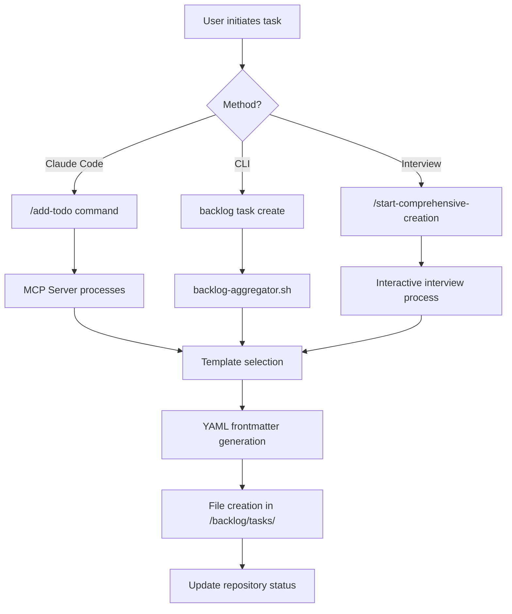
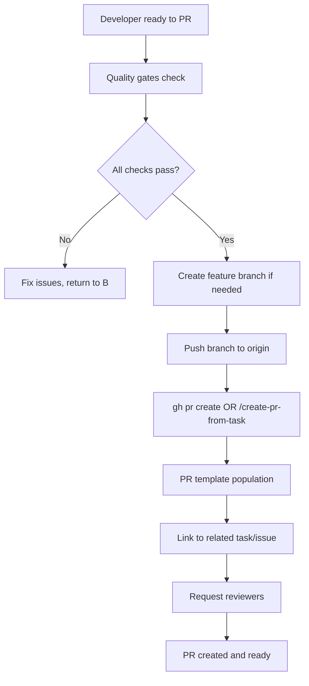
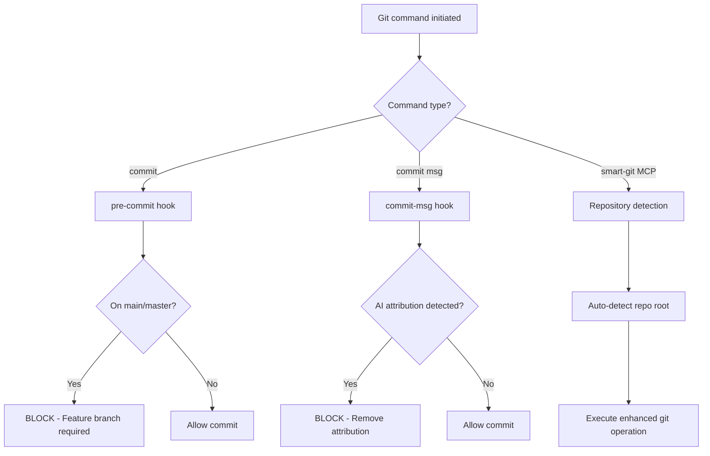
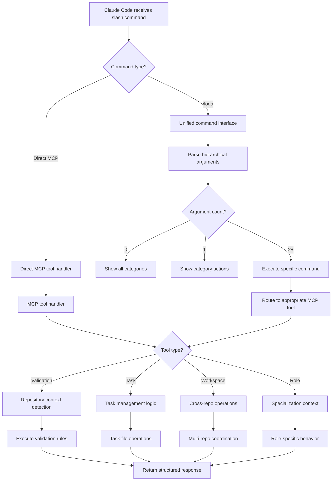
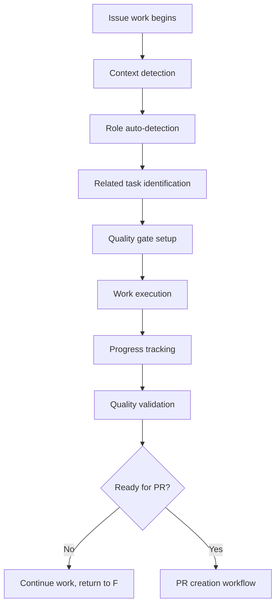

# Workflow Current State Documentation

> **Generated**: September 2025  
> **Purpose**: Complete documentation of the current workflow system before redesign

## 1. 🧱 Workflow Components Inventory

### **Core Configuration & Documentation**

| Component | Path | Type | Description | Status |
|-----------|------|------|-------------|--------|
| `CLAUDE.md` | `/loqalabs/CLAUDE.md` | **Required** | Primary 632-line workflow guidance for Claude Code | Active |
| `settings.local.json` | `/loqalabs/.claude/settings.local.json` | **Required** | Claude Code permissions (91 specific rules) | Active |
| `.mcp.json` | `/loqalabs/.mcp.json` | **Required** | MCP server configuration for enhanced development | Active |
| `.claude-code.json` | `/loqalabs/.claude-code.json` + 9 others | **Required** | Ecosystem-wide and service-specific context | Active |

### **MCP Server System**

| Component | Path | Type | Description | Status |
|-----------|------|------|-------------|--------|
| **MCP Server Core** | `/loqa/project/loqa-assistant-mcp/` | **Required** | TypeScript-based development workflow automation | Active |
| `start-mcp.sh` | `/loqa/project/loqa-assistant-mcp/start-mcp.sh` | **Required** | MCP server startup with auto-build | Active |
| `install-hooks.sh` | `/loqa/project/loqa-assistant-mcp/install-hooks.sh` | **Required** | Cross-repository Git hooks installation | Active |
| **Tool Modules** | `/loqa/project/loqa-assistant-mcp/src/tools/` | **Required** | Modular tool system (validation, task, role, workspace, workflow) | Active |

### **Unified Command Interface**

| Component | Path | Type | Description | Status |
|-----------|------|------|-------------|--------|
| **Loqa Command** | `/loqa/project/claude-code-commands/loqa.md` | **Required** | Unified CLI-style interface for all Loqa workflows | Active |
| **Command Categories** | Built into MCP server | **Required** | 4 main categories: task, dev, plan, capture | Active |
| **Argument Parsing** | Command router logic | **Required** | Hierarchical command discovery and execution | Active |

### **Git Automation & Hooks**

| Component | Path | Type | Description | Status |
|-----------|------|------|-------------|--------|
| `pre-commit-hook.sh` | Deployed to `.git/hooks/pre-commit` (8 repos) | **Required** | Branch protection (blocks main/master commits) | Active |
| `commit-msg-hook.sh` | Deployed to `.git/hooks/commit-msg` (8 repos) | **Required** | AI attribution detection and cleanup | Active |
| `smart-git MCP tools` | `/loqa/project/loqa-assistant-mcp/src/tools/smart-git-*` | **Required** | Integrated git operations via MCP server | Active |
| `cleanup-merged-branches.sh` | `/loqa/tools/cleanup-merged-branches.sh` | **Optional** | Automated cleanup of merged feature branches | Active |

### **Build & Quality Tools**

| Component | Path | Type | Description | Status |
|-----------|------|------|-------------|--------|
| **Main Makefile** | `/loqa/tools/Makefile` | **Required** | Primary development command hub | Active |
| **Service Makefiles** | Each repo has individual Makefiles | **Required** | Service-specific build, test, quality targets | Active |
| `setup.sh` | `/loqa/tools/setup.sh` | **Required** | 5-minute quick setup (pre-built images) | Active |
| `setup-dev.sh` | `/loqa/tools/setup-dev.sh` | **Optional** | Full development environment setup | Active |
| `health-check.sh` | `/loqa/tools/health-check.sh` | **Optional** | System health verification | Active |

### **Task Management System**

| Component | Path | Type | Description | Status |
|-----------|------|------|-------------|--------|
| `backlog-aggregator.sh` | `/loqa/tools/backlog-aggregator.sh` | **Required** | Cross-repository task management (19KB tool) | Active |
| `lb` | `/loqa/tools/lb` | **Optional** | Convenient wrapper for backlog-aggregator | Active |
| **Backlog Directories** | `/backlog/` in each repo | **Required** | tasks/, templates/, config.yml, drafts/ | Active |
| **Task Templates** | `/backlog/templates/` (5 types) | **Required** | Structured task creation templates | Active |

### **Service-Specific Tools**

| Component | Path | Type | Description | Status |
|-----------|------|------|-------------|--------|
| **Skills CLI** | `/loqa-hub/cmd/skills-cli/` | **Required** | Complete skill management system | Active |
| `generate.sh` | `/loqa-proto/generate.sh` | **Required** | Protocol buffer generation with commit integration | Active |
| `test-voice.sh` | `/loqa/tools/test-voice.sh` | **Optional** | Voice pipeline testing | Active |
| Various test tools | Across multiple repositories | **Optional** | wake-word, API, integration testing | Active |

## 2. 🔄 Command Lifecycle Mapping

### **Creating or Updating a Task**



**Detailed Steps**:
1. **Initiation**: `/add-todo "Title" --template=feature --priority=High` (Claude Code)
2. **MCP Processing**: Routes to `task:AddTodo` handler in MCP server
3. **Template Loading**: Loads appropriate template from `/backlog/templates/`
4. **File Generation**: Creates structured Markdown file with YAML frontmatter
5. **Repository Update**: Updates task lists and status across workspace

### **Creating a Pull Request**



**Detailed Steps**:
1. **Pre-PR Validation**: `make quality-check` (required to pass)
2. **Branch Management**: `smart-git_branch(branchName: "feature/issue-name")` MCP tool or manual creation
3. **Push**: `git push -u origin feature/issue-name`
4. **PR Creation**: `gh pr create` or MCP `/create-pr-from-task [task-id]`
5. **Metadata**: Automatic task linking, template population, reviewer assignment

### **Performing a Git Operation**



**Detailed Steps**:
1. **Hook Triggers**: Pre-commit and commit-msg hooks auto-execute
2. **Validation**: Branch protection, AI attribution detection
3. **Smart Git MCP Tools**: Enhanced operations with auto-repository detection via MCP server
4. **Quality Integration**: Automatic quality checks before major operations

### **Using a Slash Command (MCP)**



**Unified Command Interface** (`/loqa`):
- **Discovery**: `/loqa` → show categories, `/loqa [category]` → show actions
- **Task Management**: `/loqa task create`, `/loqa task list`, `/loqa task resume`
- **Development**: `/loqa dev work`, `/loqa dev branch`, `/loqa dev pr`, `/loqa dev test`
- **Planning**: `/loqa plan recommend`, `/loqa plan strategy`
- **Capture**: `/loqa capture thought`, `/loqa capture idea`

**Direct MCP Commands** (50+ total):
- **Validation**: `/validate-commit-message`, `/get-repository-info`, `/diagnose-workspace`
- **Task Management**: `/add-todo`, `/capture-thought`, `/list-tasks`, `/start-task-work`
- **Role Management**: `/set-role`, `/detect-role`, `/get-role-config`
- **Workspace**: `/workspace-status`, `/run-quality-checks`, `/create-branch-from-task`
- **Workflow**: `/plan-strategic-shift`, `/start-complex-todo`
- **Smart Git**: `smart-git_status`, `smart-git_branch`, `smart-git_commit`, `smart-git_sync`, `smart-git_context`, `git_guidance`

### **Working on an Issue (Claude Code)**



**Detailed Steps**:
1. **Context Setup**: MCP server detects repository, role, related tasks
2. **Task Linking**: Automatic connection to backlog items
3. **Role Specialization**: Adapts behavior based on detected role
4. **Progress Tracking**: Real-time task status updates
5. **Quality Gates**: Continuous validation throughout development

## 3. 🧠 Defined Rules & Conventions

### **Branch Naming Conventions**
- **Required Prefixes**: `feature/`, `bugfix/`, `hotfix/`, `chore/`
- **Format**: `feature/issue-description` or `feature/issue-123-description`
- **Enforcement**: Pre-commit hooks block non-conforming branches

### **Commit Message Rules**
- **Prohibited**: Any AI attribution ("🤖 Generated with Claude Code", "Co-Authored-By: Claude")
- **Recommended**: Conventional commits format
- **Enforcement**: commit-msg hook blocks violations

### **Quality Gate Requirements (NON-NEGOTIABLE)**
```bash
# Go Services
make quality-check    # format + lint + vet + test

# JavaScript Services  
npm run quality-check # lint + format + type-check

# Protocol Repository
make quality-check    # format + lint + validate + breaking
```

### **Multi-Repository Coordination**
- **Dependency Order**: `loqa-proto → loqa-skills → loqa-hub → loqa-relay → loqa-commander`
- **Breaking Changes**: Matching feature branches across ALL affected repos
- **Protocol Changes**: Update loqa-proto FIRST, then consuming services

### **Task Management Conventions**
- **Templates**: 5 standardized types (feature, bug-fix, protocol-change, cross-repo, general)
- **Priority System**: High/Medium/Low with intelligent sorting
- **File Structure**: YAML frontmatter + Markdown content
- **Location**: `/backlog/tasks/task-NNN-title.md`

### **Role-Based Specialization**
- **Available Roles**: architect, developer, devops, qa, general
- **Context Switching**: Automatic detection based on file types, repository, task content
- **Behavior Adaptation**: Role-specific templates, commands, recommendations

## 4. 🕸️ Dependency Mapping

```mermaid
graph TD
    A[CLAUDE.md] --> B[Claude Code Behavior]
    C[settings.local.json] --> B
    D[.claude-code.json files] --> B
    
    E[MCP Server] --> F[/add-todo command]
    E --> G[/capture-thought command]  
    E --> H[/workspace-status command]
    E --> I[Other MCP commands]
    
    J[backlog-aggregator.sh] --> K[Task Management CLI]
    J --> L[Cross-repo coordination]
    
    M[Git Hooks] --> N[Rule Enforcement]
    M --> O[AI Attribution Cleanup]
    
    P[smart-git MCP tools] --> Q[Enhanced Git Operations]
    P --> R[Repository Auto-detection]
    
    S[Makefiles] --> T[Quality Checks]
    S --> U[Build Operations]
    S --> V[Test Execution]
    
    W[Task Templates] --> X[Structured Task Creation]
    W --> Y[Consistent Documentation]
    
    B --> E
    F --> J
    G --> J
    H --> L
    N --> B
    T --> N
```

### **Core Dependencies**

1. **Claude Code** depends on:
   - `CLAUDE.md` for workflow rules
   - `settings.local.json` for permissions
   - `.claude-code.json` files for context
   - MCP server for enhanced commands

2. **MCP Server** depends on:
   - Task templates for structured creation
   - backlog-aggregator.sh for CLI operations
   - Git hooks for rule enforcement
   - Repository structure for context detection

3. **Task Management** depends on:
   - YAML frontmatter parsing
   - Template system for consistency
   - Cross-repository file scanning
   - Priority algorithms for sorting

4. **Quality Systems** depend on:
   - Service-specific Makefiles
   - Language-specific tooling (golangci-lint, ESLint)
   - Git hooks for enforcement
   - Docker for testing environments

5. **Git Automation** depends on:
   - Hook installation scripts
   - Repository discovery algorithms
   - Branch protection rules
   - Smart-git MCP tool functions

## 5. 📦 Role Breakdown

### **Developer Roles**

#### **Contributors** (General Development)
- **Tools**: Basic Claude Code commands, standard git operations
- **Access**: Public repositories, standard quality tools
- **Limitations**: No direct main branch access, PR-only workflow

#### **Maintainers** (Core Team)
- **Tools**: Full MCP server access, cross-repository coordination
- **Access**: All repositories, quality gate overrides, release management
- **Responsibilities**: Code review, release coordination, system architecture

#### **Role-Based Specialization** (AI-Detected)
- **Architect**: Strategic planning, system design, cross-cutting concerns
- **Developer**: Feature implementation, bug fixes, code quality
- **DevOps**: Infrastructure, deployment, monitoring, automation
- **QA**: Testing, validation, quality assurance, documentation

### **Tool Reusability**

#### **Project-Specific** (Loqa Only)
- MCP server with Loqa-specific commands
- Task templates with project context
- Service-specific build tools
- Protocol buffer generation

#### **Reusable Components**
- Git hooks system (adaptable to other projects)
- backlog-aggregator.sh concept
- Claude Code permission patterns
- Quality gate frameworks

## 6. 🧩 Summary & Observations

### **Strengths**

1. **Comprehensive Automation**: End-to-end workflow automation from task creation to PR merge
2. **Multi-Repository Coordination**: Sophisticated cross-repo dependency management
3. **Quality Enforcement**: Non-negotiable quality gates with automated enforcement
4. **AI Integration**: Seamless Claude Code integration with intelligent assistance
5. **Role-Based Specialization**: Context-aware behavior adaptation
6. **Structured Task Management**: Template-driven, consistent task creation and tracking

### **Weaknesses**

1. **High Complexity**: 50+ tools and scripts with intricate dependencies
2. **Steep Learning Curve**: Requires understanding of MCP, Git hooks, multiple CLIs
3. **Maintenance Overhead**: Complex system requiring constant updates and synchronization
4. **Single Point of Failure**: MCP server dependency for many advanced features
5. **Configuration Sprawl**: Multiple config files (10+ .claude-code.json files)
6. **Tool Fragmentation**: Functionality spread across many different interfaces

### **Areas of Uncertainty**

1. **Command Discoverability**: The unified `/loqa` command addresses this with hierarchical discovery, but users must still learn the 4-category structure
2. **Interface Duality**: Both unified `/loqa` commands AND direct MCP commands exist - potential confusion about which to use when
3. **Error Recovery**: What happens when MCP server fails or hooks malfunction?
4. **Cross-Platform Compatibility**: Bash scripts and shell dependencies
5. **Performance Impact**: Multiple hook executions and quality checks on every operation
6. **Maintainability**: Who maintains the complex MCP server codebase plus unified command interface?
7. **User Experience**: Is the learning curve worth the automation benefits?

### **Technical Observations**

1. **Architecture Pattern**: Event-driven workflow with hooks, MCP commands, and CLI tools
2. **Integration Strategy**: Heavy Claude Code integration with fallback CLI options
3. **Quality Philosophy**: "All or nothing" approach - no compromises on quality gates
4. **Coordination Method**: File-based task management with cross-repository scanning
5. **Extensibility**: Modular tool system allows for adding new capabilities

### **Workflow Maturity**

The current system represents a **highly sophisticated but complex** workflow automation platform that prioritizes:
- **Quality over speed** (mandatory quality gates)
- **Consistency over flexibility** (strict templates and rules)
- **Automation over manual control** (extensive hook and MCP integration)
- **AI assistance over traditional tooling** (Claude Code-first approach)

This system is clearly designed for a **mature development team** that values comprehensive automation and is willing to invest in learning and maintaining a complex toolchain for long-term productivity gains.